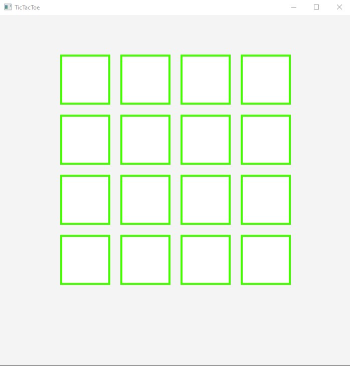

# Tic-Tac-Toe
4x4 Tic Tac Toe Board Game created using JavaFX

Each player takes a turn making a move until one player has 4 in a row or there are no more spaces.

# Game Play

 

## What I learned

Learned the basics of using JavaFX to be able to create simple UI programs.

## Overview of the tools I learned/used

* Usage of Scenes and placing them onto the Stage

* Create buttons, images and labels.

* Organize elements using VBox, Hbox, Gridpane, 

* Create event handlers for the elements.

* Control elements using functions like setVisible, setAlignment, etc...

